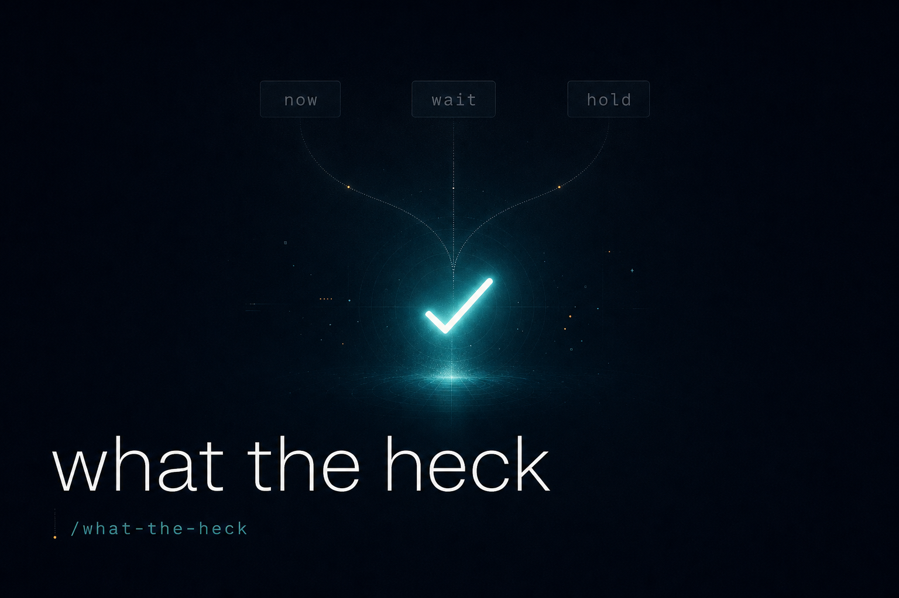

# What The Heck 🫷

**English** · [中文](README.zh-CN.md)



**A one-word command that makes your AI stop hedging and tell you what it actually thinks.**

> `/what-the-heck`

A [Claude Code](https://docs.claude.com/en/docs/claude-code) skill, tuned for the
single most annoying habit of the most capable models — including **Claude Opus
4.8**: they *have* an opinion, they just won't commit to it. Instead of an answer,
you get a tidy numbered menu and the job of picking is quietly handed back to you.

This skill is the user's "**what the heck are you doing?**" — say it, and the model
is forced to run an honest self-audit, name its single real recommendation, and
(when the call is reversible and low-stakes) just *do it*.

---

## The problem it fixes — "不说人话"

The smarter the model, the more politely it dodges. You ask for a decision and get:

```
How would you like to proceed?
  1. Merge it now
  2. Wait for the companion PR
  3. Hold and revisit later
```

…on a pull request that was **already approved** and points at a commit that's
**already merged**. There is one answer. The model knows it. The three-option
wrapper isn't deference — it's **procedural politeness as cost-shifting**: it
looks like respect for your autonomy, but it's actually a refusal to commit
judgment, pushing the decision cost back onto you.

The failure has a few recurring disguises:

- **Time-axis selectors** — "do it now / do it later / hold" (one decision, three
  delays).
- **Tactical punts** — "should I do it in one commit or two?" *after* finishing
  the entire analysis.
- **Fake balance** — listing a path it already knows is wrong as if it were a
  real 50/50.
- **Unverified scope** — "this needs five new files" for code that already exists;
  "that's too heavy, let's not" without ever measuring the cost.
- **Filler questions** — confirmation theater disguised as thoroughness.

You hired an assistant to assess and recommend, not to **administer a poll**.

## What it does

When you type `/what-the-heck`, the skill makes the model:

1. **Confess its actual pick.** "Before you listed options, what was your internal
   top choice?" — state it in one sentence, or admit there wasn't one (that's the
   tell).
2. **Classify the decision honestly.** Real subjective tradeoff (blast radius,
   your taste, irreversibility, a compliance boundary) → keep *one* recommendation
   plus the tradeoff. Fake option (same outcome, only delay differs / approved &
   low-risk / a known-wrong path on the menu) → there was nothing to ask.
3. **Commit — and for reversible, low-cognition calls, act in the same turn.** No
   second "shall I proceed?". It reports the action in past tense: *"merged ✅,
   continued."*

You can always override. That's *your* job — not something to be pre-blessed with
a multiple-choice quiz.

## See it in action

The skill ships with [**real, anonymized case studies**](examples/case-studies.md)
([中文](examples/case-studies.zh-CN.md)) from daily agentic-coding work. They are
pure before/after — the model's *own* two outputs, with no user words in between.
That's the whole demonstration: the facts don't change, only whether the model
commits to the answer it already had.

Here is the most clear-cut one. The assistant finishes the work, then hands you a
numbered menu where all three options are the same action with a different label:

**Before** (the hedge):

> The change is implemented and tested. But the branch is named after one ticket,
> while this is really a regression of a *different* ticket's PR.
>
> Three options, pick one and I'll execute commit + PR immediately:
>
> 1. **Open a new ticket** (cleanest) — you give me the key, I rename branch + commit + PR
> 2. **File it under the regression-source ticket** — rename branch + commit message accordingly
> 3. **Keep the current ticket** — don't touch anything, just commit
>
> You decide.

**After** — `/what-the-heck`, and the same model runs the three-point audit:

> **§1** — What I internally wanted was to keep the current ticket + branch name —
> it's the lowest-cognition path (worktree already built, branch already named).
>
> **§2** — Filler. The three options differ only in which ticket-key *string* gets
> used — zero blast radius, zero strategic difference between them.
>
> **§3** — Just do it.

A textbook 3-item selector dressed as "I'll execute immediately" collapsed into a
one-line decision once the model admitted the options were string-substitutions
with no real tradeoff.

Eight full before/after cases — including a Pro/Con matrix a written rule had
already settled, an "(A)/(B)/(C) which fix?" whose honest answer was *write no code
at all*, and a "nod and I'll do both" that held a recommendation hostage to a
needless OK — are in [`examples/case-studies.md`](examples/case-studies.md)
([中文](examples/case-studies.zh-CN.md)).

## Install

This is a Claude Code plugin. Add the marketplace and enable the plugin in
`~/.claude/settings.json`:

```jsonc
{
  "enabledPlugins": {
    "what-the-heck@what-the-heck": true
  },
  "extraKnownMarketplaces": {
    "what-the-heck": {
      "source": { "source": "github", "repo": "mclamee/what-the-heck" },
      "autoUpdate": true
    }
  }
}
```

Then, in a Claude Code session:

```
/reload-plugins
/plugin            # verify "what-the-heck" is listed under Installed
```

Invoke it any time the model hands you a menu instead of an answer:

```
/what-the-heck
```

You don't need to re-explain which options you're challenging — the skill knows
it's reacting to the turn it just produced.

### Or: install with the `skills` CLI (any agent)

The repo is [`skills`](https://www.npmjs.com/package/skills)-compatible, so it
installs across Claude Code, Codex, Cursor, Gemini CLI, and more:

```bash
# -a names the agents to install into (omit it and it auto-detects);
# always scope it — an unscoped add can scatter empty agent dirs
npx skills add mclamee/what-the-heck -a 'Claude Code'

npx skills list                 # confirm it's installed
npx skills remove what-the-heck # uninstall
```

> **No CLI at all?** The skill is a single self-contained Markdown file:
> [`skills/what-the-heck/SKILL.md`](skills/what-the-heck/SKILL.md). Paste it into
> any agent's system prompt or rules file, or trigger it manually by saying
> *"run the what-the-heck audit."* The audit is model-agnostic.

## Verify it works

You don't have to take the claim on faith — reproduce the effect in ~2 minutes:

1. In a fresh session, give the model a clearly one-answer decision and invite a
   menu, e.g.: *"This chore PR is already approved with no findings. Should I
   merge now, wait, or hold?"* Most frontier models will hand you back the
   three-option menu.
2. Reply `/what-the-heck` (or, without the plugin: *"run the what-the-heck
   audit"*).
3. Watch it produce the §1/§2/§3 audit, call the three options filler, and commit
   to a single answer instead of re-asking.

The eight [case studies](examples/case-studies.md) are real instances of exactly
this, captured from day-to-day work.

## Security & trust

- **Zero network calls, zero telemetry, no code execution.** The skill is one
  Markdown file — instructions the model reads. It does not run scripts, does not
  phone home, and never needs `--dangerously-skip-permissions`.
- **`autoUpdate` is opt-out.** The marketplace snippet above sets
  `autoUpdate: true` for convenience; set it to `false` to pin the version and
  review updates yourself.
- **MIT licensed**, all of it readable in
  [`skills/what-the-heck/SKILL.md`](skills/what-the-heck/SKILL.md) (~120 lines).

## Why it's tuned for Opus 4.8

Capability and hedging scale together. A weaker model gives a wrong answer
confidently; a frontier model gives the *right* answer and then refuses to stand
behind it, because the marginal "safe" move is always to offer you the choice.
Opus 4.8 is exceptional at the analysis and then, disproportionately often,
launders that analysis into a selector. This skill is a targeted counterweight:
it doesn't make the model dumber or more reckless — it makes it **finish the
sentence it already started**.

## Philosophy

Three heuristics, lifted straight from the skill:

1. **"If forced to pick right now"** — finish "I'd pick ___ because ___" before
   writing any list. If it comes out clean, that *is* the answer; delete the list.
2. **"Is the user's taste the decisive factor?"** — if yes, one recommendation
   plus the tradeoff. If no, just act.
3. **"Am I making them say *go ahead* to something obvious?"** — that's
   cost-shifting dressed as courtesy. Go ahead.

## Contributing

Got a transcript where your model handed you a fake menu? Anonymize it and open a
PR against [`examples/case-studies.md`](examples/case-studies.md) — the corpus of
"here's the shape in the wild" is what makes the trigger sharper.

## License

[MIT](LICENSE) © Mclamee

---

*This skill is itself a retro artifact: someone needed a named tool to call out
the pattern, which means it was happening often enough to deserve a name. Use it,
and skip the pattern before it needs naming a third time.*
